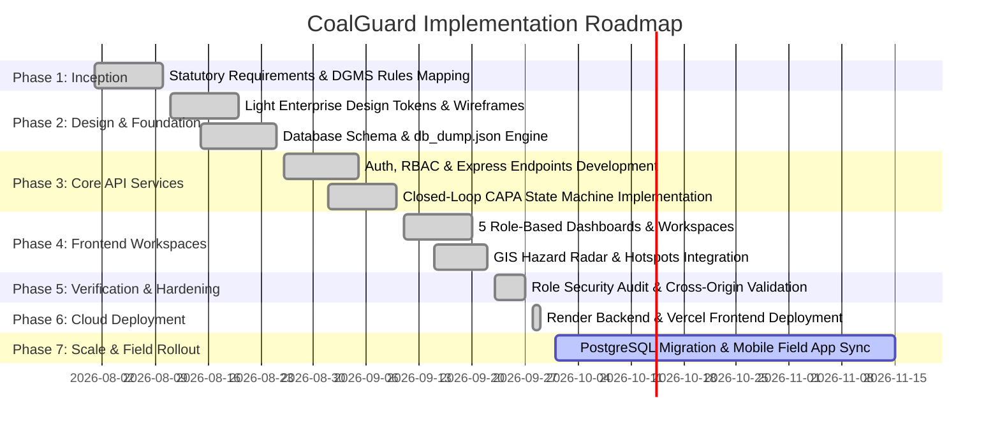

# CoalGuard — Comprehensive Technology Stack & Implementation Blueprint

> **System Name:** CoalGuard — AI-Based Smart Governance and Compliance Monitoring System for Coal Mines  
> **Authority:** Ministry of Coal • Coal India Limited (CIL)  
> **Version:** 2.0 (Light Enterprise Edition)  
> **Live Web Client:** [coalguard-three.vercel.app](https://coalguard-three.vercel.app)  
> **Live API Service:** [coalguard-backend-rrfu.onrender.com](https://coalguard-backend-rrfu.onrender.com)  
> **Classification:** Enterprise Architecture & Technical Specification Manual

---

## 1. Executive Summary & Purpose

**CoalGuard** is a mission-critical digital governance platform engineered to enforce statutory mine safety regulations, workforce health credentials, contractor compliance, and environmental safeguards across all subsidiaries of Coal India Limited (CIL) — including **ECL, BCCL, CCL, WCL, SECL, NCL, and MCL**.

The system replaces manual paper logs and fragmented spreadsheets with a single, verifiable, auditable chain of governance adhering to:
- **Coal Mines Regulations (CMR) 2017** (DGMS safety compliance, bench slope limits, haul road berm heights, ventilation standards).
- **Mines Act 1952** (Statutory responsibility, accident reporting, occupational safety).
- **Mines Rules 1955 — Rule 29B** (Mandatory Form O Periodic Medical Examinations - PME).
- **Mines Vocational Training Rules (MVTR) 1966** (Mandatory workforce safety certifications, gas testing tickets, blasting credentials).

---

## 2. End-to-End System Architecture

```
┌────────────────────────────────────────────────────────────────────────────────────────┐
│                        PRESENTATION TIER (Vercel Edge CDN)                             │
│                                                                                        │
│   React 19 (SPA) + TypeScript + Tailwind CSS (Light Enterprise Institutional Theme)    │
│                                                                                        │
│   ├── Client Security & RBAC: React Router DOM v7 + RoleRouteGuard + AuthContext       │
│   ├── Statutory Role Workspaces:                                                       │
│   │   ├── 1. Corporate Management (CIL HQ Multi-Subsidiary Radar & Report Signoff)     │
│   │   ├── 2. Mine Manager (Pit-Level Operations, Directives, CAPA Formal Closure)     │
│   │   ├── 3. Field Safety Officer (Geotagged Audits, Observations, Verification)       │
│   │   ├── 4. Worker Management (DGMS Form O PME, MVTR 1966, KYC & Biometrics)          │
│   │   └── 5. Registered Contractor (Assigned Obligations, Directives & Proof Upload)   │
│   ├── Interactive Analytics: Recharts Telemetry, Risk Curves & Trend Lines             │
│   └── Geospatial Interface: Leaflet / React-Leaflet GIS Hazard Radar & Hotspots        │
└───────────────────────────────────────────┬────────────────────────────────────────────┘
                                            │
                                            │ HTTPS REST Requests (Bearer Token / JSON)
                                            │ Multipart Form Data (Inspection Photos)
                                            ▼
┌────────────────────────────────────────────────────────────────────────────────────────┐
│                        APPLICATION & API TIER (Render Web Service)                     │
│                                                                                        │
│   Node.js (v20+) + Express 5 + tsx (TypeScript Runtime Engine)                         │
│                                                                                        │
│   ├── Middleware: CORS (Cross-Origin Protection), Multer (Geotagged Image Uploads)     │
│   ├── API Routing Modules:                                                             │
│   │   ├── /api/auth (Statutory Role-Based Access Control & Quick Switching)            │
│   │   ├── /api/dashboard (Subsidiary KPIs, Safety Scores & Active Alerts)              │
│   │   ├── /api/inspections (Audits, Observations & Geotagged Evidence)                 │
│   │   ├── /api/violations & /api/corrective-actions (4-Stage Closed-Loop CAPA)         │
│   │   ├── /api/workers & /api/contractors (PME Fitness, Vocational Certs)              │
│   │   ├── /api/gis (Mine Pit Lat/Lng, Berm Coordinates, Hazard Overlays)               │
│   │   ├── /api/reports (Monthly Statutory Dossiers, Reviews & Approvals)               │
│   │   ├── /api/ai (Predictive Compliance Scoring & Anomaly Detection)                  │
│   │   └── /api/governance, /api/alerts, /api/audit-logs                                │
│   ├── AI Analytics Engine: Multi-Factor Hazard Scoring & Repeat Offender Weighting     │
│   └── Closed-Loop CAPA State Machine: Non-Negotiable Remediation Sequence              │
└───────────────────────────────────────────┬────────────────────────────────────────────┘
                                            │
                                            ▼
┌────────────────────────────────────────────────────────────────────────────────────────┐
│                        DATA PERSISTENCE TIER (In-Memory / JSON Seed Engine)            │
│                                                                                        │
│   Seeded Data Store: db_dump.json (25 Relational Tables)                               │
│   ├── Zero-latency in-memory query evaluation and transactional array mutation         │
│   ├── File-backed disk dumps ensuring persistence across restarts                      │
│   └── Production Upgrade Path: Direct drop-in PostgreSQL adapter ready                 │
└────────────────────────────────────────────────────────────────────────────────────────┘
```

---

## 3. Detailed Technology Stack Breakdown

### 3.1. Frontend Client Tier

| Technology | Version | Purpose | Technical Rationale |
| :--- | :--- | :--- | :--- |
| **React** | `^19.2.8` | UI Framework | Declarative component model utilizing concurrent mode and transition primitives for real-time dashboard responsiveness. |
| **TypeScript** | `~6.0.2` | Programming Language | Enforces strict compile-time types across statutory models, API responses, and form states, eliminating runtime type errors. |
| **Vite** | `^8.3.1` | Build Tool & Bundler | Instant Hot Module Replacement (HMR) in development and highly optimized Rollup production code-splitting and asset compression. |
| **React Router DOM** | `^7.18.4` | Client-Side Routing | Provides declarative nested routing, route-level authorization guards (`RoleRouteGuard`), and URL-driven state preservation. |
| **Tailwind CSS** | `^3.4.19` | Design System Styling | Custom institutional Light Enterprise design tokens (`#F5F7FA` canvas, clean card surfaces, `#1D4ED8` corporate blue, accessible status borders). |
| **Lucide React** | `^1.48.0` | Iconography | High-clarity, accessible SVG icon suite optimized for government/enterprise workflows, safety badges, and statutory statuses. |
| **Recharts** | `^3.10.1` | Data Visualization | Composable SVG chart primitives powering monthly compliance trajectories, violation severity breakdowns, and predictive curves. |
| **Leaflet & React-Leaflet** | `^1.9.4` / `^5.0.0` | Geospatial GIS Mapping | Interactive cartographic rendering of opencast mine boundaries, haul road berms, dump slopes, and active hazard coordinates. |
| **clsx & tailwind-merge** | `^2.1.1` / `^3.7.0` | Utility Classes | Handles dynamic conditional CSS class composition without Tailwind specificity collisions. |

---

### 3.2. Backend API Tier

| Technology | Version | Purpose | Technical Rationale |
| :--- | :--- | :--- | :--- |
| **Node.js** | `>=20.x` | Runtime Environment | High-throughput asynchronous event-driven JavaScript/TypeScript server runtime. |
| **Express** | `^5.2.1` | HTTP API Framework | Minimalist, robust web server handling REST endpoints, error-handling middleware, and static file delivery. |
| **tsx** | `^4.23.15` | TypeScript Runner | Native Node.js TypeScript execution engine; eliminates pre-compilation build overhead. |
| **CORS** | `^2.8.6` | Cross-Origin Security | Enables strict cross-origin resource sharing between the Vercel frontend origin and the Render backend service. |
| **Multer** | `^2.4.0` | Multipart File Handling | Parses and stores date-stamped photographic evidence, Form O medical scans, and contractor CAPA rectification proofs. |
| **In-Memory Seed Engine** | Native | Data Store | Backed by `db_dump.json`, providing atomic in-memory querying across 25 relational tables representing CIL subsidiaries. |

---

### 3.3. AI Risk Analysis & Heuristic Engine

The AI risk engine calculates a real-time statutory risk posture score ($0 - 100$) for each mine pit and contractor based on three weighted vectors:

$$\text{Risk Score} = w_1 \cdot \text{Severity Factor} + w_2 \cdot \text{Overdue CAPA Factor} + w_3 \cdot \text{Workforce Non-Compliance Factor}$$

Where:
- **Severity Factor ($40\%$):** Critical violations under CMR 2017 (e.g., inadequate berm height on haul roads, unstable bench slopes, gas threshold exceedances).
- **Overdue CAPA Factor ($35\%$):** Number of days directives have remained unresolved past statutory deadlines, multiplied by an escalation multiplier ($1.5\times$ past 7 days, $3.0\times$ past 14 days).
- **Workforce Non-Compliance Factor ($25\%$):** Percentage of deployed contractor workforce with expired Form O PME medicals or lacking MVTR 1966 safety certifications.

---

### 3.4. Closed-Loop CAPA State Machine

The platform enforces a 4-stage remediation sequence with role segregation:

```
┌─────────────────────────┐
│       STAGE 1           │  Mine Manager / Field Officer issues non-compliance notice.
│   DIRECTIVE ISSUED      │  Statutory deadline assigned (e.g. 48 hours for Critical).
└────────────┬────────────┘
             │
             ▼
┌─────────────────────────┐
│       STAGE 2           │  Contractor physically rectifies hazard on site.
│  RECTIFIED BY VENDOR    │  Uploads date-stamped, geotagged photographic proof.
└────────────┬────────────┘
             │
             ▼
┌─────────────────────────┐
│       STAGE 3           │  Field Safety Officer visits coordinate.
│   FIELD VERIFICATION    │  Issues verdict: FIXED (passes) or NOT FIXED (reverted).
└────────────┬────────────┘
             │
             ▼
┌─────────────────────────┐
│       STAGE 4           │  Mine Manager conducts statutory review of evidence dossier.
│     FORMAL CLOSURE      │  Signs off on closure with immutable audit trail entry.
└─────────────────────────┘
```

---

## 4. Statutory Relational Data Catalog (25 Entities)

The system manages 25 interconnected entities:

| # | Entity Table | Primary Key | Description & Statutory Context |
| :--- | :--- | :--- | :--- |
| **1** | `subsidiaries` | `id` | CIL operating subsidiaries: ECL, BCCL, CCL, WCL, SECL, NCL, MCL. |
| **2** | `mines` | `id` | Opencast & underground mine records with DGMS registration numbers. |
| **3** | `users` | `id` | Personnel profiles with role designations and subsidiary mappings. |
| **4** | `contractors` | `id` | Commercial mining contractors with vendor ratings and compliance scores. |
| **5** | `contracts` | `id` | Active mining contracts, safety tender clauses, validity terms, and SLAs. |
| **6** | `workers` | `id` | Mine personnel with biometric IDs, designations, and contractor links. |
| **7** | `compliance_records`| `id` | Daily statutory inspection logs mapped to specific DGMS and CMR 2017 rules. |
| **8** | `alerts` | `id` | Real-time automated safety alerts and emergency escalation events. |
| **9** | `documents` | `id` | Statutory files, DGMS circulars, standard operating procedures (SOPs). |
| **10** | `attendance` | `id` | Shift-wise biometric attendance, fatigue hours, and rest intervals. |
| **11** | `medical_records` | `id` | Mines Rules 1955 Form O PME certificates, audiology, and chest X-rays. |
| **12** | `inspections` | `id` | Formal inspection audits executed by statutory Field Safety Officers. |
| **13** | `contract_requirements`| `id`| Mandatory safety equipment and certified worker quotas per contract. |
| **14** | `inspection_checklists`| `id`| Standardized questions: berm height, bench slope, dust suppression, PPE. |
| **15** | `inspection_observations`| `id`| Findings recorded by inspectors during on-site pit walks. |
| **16** | `geo_evidence` | `id` | Latitude, longitude, altitude, and timestamped photo proof. |
| **17** | `violations` | `id` | Classified statutory breaches: *Critical, High, Medium, Low*. |
| **18** | `corrective_actions` | `id` | 4-stage CAPA records tracking remediation and verification proof. |
| **19** | `reports` | `id` | Monthly statutory compliance dossiers submitted for CIL approval. |
| **20** | `report_reviews` | `id` | Corporate executive review commentary, revision directives, and approvals. |
| **21** | `training_records` | `id` | Mandatory MVTR 1966 vocational training modules completed by workers. |
| **22** | `certification_records` | `id`| Blaster licenses, gas testing certificates, heavy machinery permits. |
| **23** | `escalation_logs` | `id` | System-triggered escalations when CAPAs exceed statutory deadlines. |
| **24** | `ai_predictions` | `id` | Predictive hazard likelihood scores and root-cause factor breakdowns. |
| **25** | `audit_logs` | `id` | Immutable chronological logs of all user actions across the platform. |

---

## 5. Seven-Phase Implementation Plan



### Detailed Phase Specifications

#### Phase 1: Statutory Framework Discovery & Legal Alignment
- Map all compliance workflows directly to the **Coal Mines Regulations (CMR) 2017**, **Mines Act 1952**, and **Mines Rules 1955**.
- Codify mandatory inspection checklists:
  - Haul road berm height ($\ge \frac{1}{3}$ largest dumper wheel diameter).
  - Bench height-to-width ratios.
  - Active water sprinkling and dust suppression standards.
  - Periodic Medical Examination (Form O PME) valid within statutory intervals.

#### Phase 2: Design System Foundation & Data Modeling
- Establish the **Light Enterprise Institutional UI Design System**:
  - Background canvas: `#F5F7FA`.
  - Surface cards: `#FFFFFF` with `#E2E8F0` borders and subtle box-shadows.
  - Primary institutional action color: `#1D4ED8` (deep corporate blue).
  - Typography: Google Inter (`sans-serif`) paired with JetBrains Mono for statutory codes.
- Model all 25 relational entities in `db_dump.json` pre-seeded with representative data across CIL subsidiaries.

#### Phase 3: Backend API Architecture & State Machine
- Implement the REST API server using **Express 5** and **tsx**.
- Build the **Closed-Loop CAPA State Machine**:
  - Prevent unauthorized state transitions (e.g. contractor cannot mark an item as "Closed"; only the Mine Manager can execute formal closure).
  - Implement Multer for date-stamped photo evidence upload.
- Configure global CORS policy to support distributed multi-cloud architectures.

#### Phase 4: Statutory Role Workspaces & Frontend Modules
- Implement the 5 statutory workspaces with `RoleRouteGuard`:
  1. **Corporate Dashboard:** Multi-subsidiary governance, safety scores, report signoff.
  2. **Mine Manager Dashboard:** Pit operations, hazard remediation tracking, CAPA closure.
  3. **Field Officer Dashboard:** On-site inspection logs, observations, physical verification.
  4. **Worker Management Dashboard:** Form O PME tracking, MVTR 1966 credentials, contractor worker KYC.
  5. **Contractor Portal:** Directives, deployed worker rosters, photographic proof submissions.
- Implement **Leaflet GIS Hazard Radar** for interactive mine spatial visualization.

#### Phase 5: Verification, Testing & Cross-Platform Hardening
- Audit role-based access control to ensure complete tenant and role isolation.
- Validate dynamic URL resolution via `VITE_API_BASE` to prevent trailing slash collisions.
- Execute full production bundling (`tsc -b && vite build`) with zero linting or type errors.

#### Phase 6: Cloud Deployment & Production Delivery (COMPLETED)
- **Backend Deployment on Render:**
  - Automated Node.js deployment running `npm start` via `tsx server.ts`.
  - Configured health probe at `/health`.
  - Live at `https://coalguard-backend-rrfu.onrender.com`.
- **Frontend Deployment on Vercel:**
  - Vite SPA compilation deployed to Vercel global edge network.
  - SPA rewrite rules via `vercel.json`.
  - Live at `https://coalguard-three.vercel.app`.

#### Phase 7: Scale & Future Roadmap
- **Database Migration:** Replace the in-memory JSON store with a managed PostgreSQL instance on Render/AWS RDS.
- **Offline-First Field Mobile App:** Implement Progressive Web App (PWA) capabilities with IndexedDB sync for underground and low-connectivity opencast pits.
- **Automated Computer Vision (CV):** Integrate drone-based aerial imagery analysis to automatically measure haul road berm heights and bench slope angles against CMR 2017 standards.

---

## 6. Production Maintenance & Operational Protocol

1. **Uptime Monitoring:** Render free-tier web services idle after 15 minutes of inactivity. For continuous, zero-latency response times:
   - Configure a free monitoring ping (e.g., via UptimeRobot or Cron-Job.org) pinging `https://coalguard-backend-rrfu.onrender.com/health` every 10 minutes.
2. **Environment Variable Changes:** If the backend URL ever changes, update `VITE_API_BASE` in the Vercel dashboard and trigger a redeployment to bake the new endpoint into the client bundle.
3. **Data Backups:** Regular snapshots of `db_dump.json` ensure statutory audit trail integrity.
